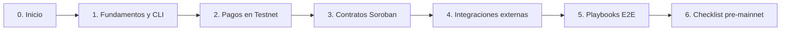
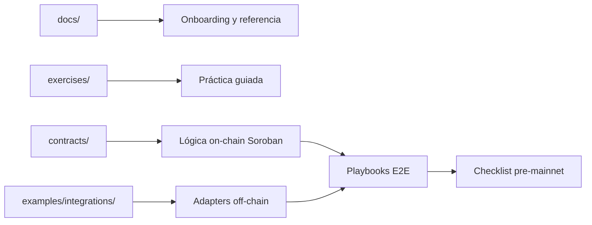
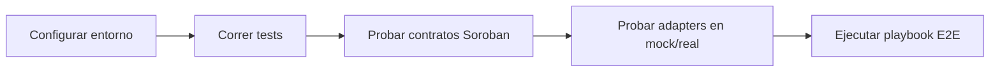
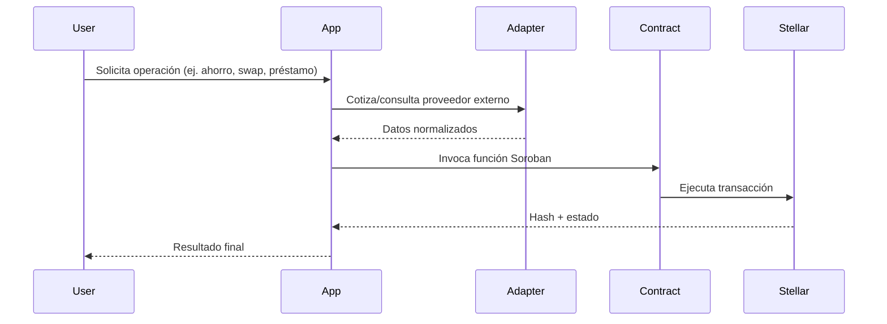

# Stellar Guide (Talleres en Español)

Guía visual y práctica para aprender **Stellar + Soroban** desde cero, con rutas por perfil, contratos listos, integraciones reales y playbooks de producto.


## 🎓 Curso de 12 semanas (para impartir clases)

¿Quieres dar un **curso completo** sobre Stellar? Hay una capa pedagógica lista para enseñar en
[`course/`](course/README.md): syllabus, teoría (consenso SCP, arquitectura), plan de clase semana a
semana, labs calificados, banco de quizzes, rúbricas y proyecto final.

- **Programa completo:** [course/syllabus.md](course/syllabus.md)
- **Para docentes (cómo incorporarlo en clase):** [course/programa-docentes.md](course/programa-docentes.md)
- **Mapa del curso:** [course/README.md](course/README.md)
- **Teoría de consenso (SCP/FBA):** [course/teoria/02-consenso-scp.md](course/teoria/02-consenso-scp.md)

El curso reutiliza los `docs/`, `contracts/` y `examples/` de este repo como material de laboratorio.

## Empieza aquí

Guía práctica para aprender haciendo: pagos, contratos e integraciones en Stellar.

## Requisitos mínimos

- Terminal básica.
- Ganas de probar cosas.
- JS o Rust ayudan, pero no son obligatorios para arrancar.

## Mapa rápido



## Mini glosario

- **Stellar**: red para pagos y activos digitales.
- **Soroban**: plataforma de smart contracts en Stellar.
- **Testnet**: red de pruebas (sin dinero real).
- **SEP**: estándares para que wallets/proveedores se entiendan entre sí.
- **Adapter**: capa que conecta tu app con un proveedor externo.

## Guía concentrada (todo en un solo lugar)

| Bloque | Qué resuelve | Dónde empezar |
|---|---|---|
| Fundamentos | Cuentas, red, CLI y flujos base | [docs/introduccion.md](docs/introduccion.md) |
| Pagos | Crear cuentas y enviar XLM | [exercises/01-pago-simple.md](exercises/01-pago-simple.md) |
| Contratos | Casos de negocio en Soroban | [docs/contratos-casos-uso.md](docs/contratos-casos-uso.md) |
| Frontend | Probar funciones de contrato desde UI | [docs/frontend-contratos.md](docs/frontend-contratos.md) |
| Integraciones | Conectar protocolos externos | [docs/integraciones-protocolos.md](docs/integraciones-protocolos.md) |
| Operación | Hardening y salida a producción | [docs/checklist-pre-mainnet.md](docs/checklist-pre-mainnet.md) |

## Stack y tecnologías

| Área | Lenguajes/Tecnologías |
|---|---|
| Red y estándares | Stellar, SEP-1, SEP-6, SEP-10, SEP-12, SEP-24, SEP-31, SEP-38 |
| Contratos | Soroban, Rust, WASM |
| Integraciones | JavaScript (Node.js), Fetch API, adapters por proveedor |
| DevEx | Stellar CLI, Cargo, Mermaid, Markdown |

## Arquitectura del repositorio



## Estructura del repositorio

```text
docs/                    Guías, estándares, playbooks, operación
exercises/               Ejercicios prácticos
contracts/               Contratos Soroban listos para compilar y testear
examples/integrations/   Adapters y demos de integraciones externas
assets/                  Recursos visuales
```

## Rutas recomendadas (elige una)

### Ruta A: Primer contacto (90 min)
1. [docs/introduccion.md](docs/introduccion.md)
2. [docs/instalacion.md](docs/instalacion.md)
3. [docs/comandos-basicos.md](docs/comandos-basicos.md)
4. [docs/flujos-mermaid.md](docs/flujos-mermaid.md)
5. [exercises/01-pago-simple.md](exercises/01-pago-simple.md)

### Ruta B: Builder de contratos
1. [docs/guia-0-a-builder.md](docs/guia-0-a-builder.md)
2. [docs/contratos-casos-uso.md](docs/contratos-casos-uso.md)
3. `contracts/payroll`
4. `contracts/savings`
5. `contracts/loan`, `contracts/yield`, `contracts/nft-membership`

### Ruta C: Integraciones y producto
1. [docs/sep-estandares-anclas.md](docs/sep-estandares-anclas.md)
2. [docs/integraciones-protocolos.md](docs/integraciones-protocolos.md)
3. `examples/integrations/*`
4. [docs/playbooks-producto.md](docs/playbooks-producto.md)

## Contratos listos para practicar

| Contrato | Caso de uso | Estado |
|---|---|---|
| `contracts/payroll` | Dispersión de nómina por periodo | Listo |
| `contracts/savings` | Ahorro por metas con penalización temprana | Listo |
| `contracts/loan` | Préstamo colateralizado base | Listo |
| `contracts/yield` | Vault por shares (deposit/harvest/withdraw) | Listo |
| `contracts/nft-membership` | NFT de membresía/certificado | Listo |

## Integraciones listas para practicar

| Integración | Carpeta | Operaciones base |
|---|---|---|
| Soroswap | `examples/integrations/soroswap` | `healthcheck`, `quote`, `execute` |
| Etherfuse | `examples/integrations/etherfuse` | `lookupStablebonds`, `quoteOnramp`, `quoteOfframp` |
| Defindex | `examples/integrations/defindex` | `getApy`, `getBalance`, `deposit`, `withdraw` |
| Pollar | `examples/integrations/pollar` | `createSession`, `getRampQuote` |
| ZKProof | `examples/integrations/zkproof` | `generateProof`, `verifyLocal`, `verifyOnChainAttestation` |

## Frontend para probar contratos

Si quieres testear contratos desde UI (en vez de solo CLI), usa esta guía:

- [docs/frontend-contratos.md](docs/frontend-contratos.md)

Incluye:
- estructura mínima de frontend,
- setup de SDK,
- ejemplo de invocación de contrato,
- ejemplo de UI con botón de ejecución.

## Flujos Mermaid clave

### Flujo 1: De dev local a demo funcional


### Flujo 2: Producto híbrido (on-chain + off-chain)


## Quickstart (copiar y correr)

### 1) Integraciones (modo demo/mock)
```bash
cd examples/integrations
cp .env.example .env
npm install
INTEGRATIONS_USE_MOCK=true npm test
INTEGRATIONS_USE_MOCK=true npm run smoke:all
```

### 2) Contratos Soroban (tests)
```bash
cargo test -p payroll -p savings -p loan -p yield -p nft-membership
```

### 3) Pago rápido en Testnet
```bash
stellar tx new payment \
  --source <CUENTA_ORIGEN> \
  --destination <CUENTA_DESTINO_PUBLICA> \
  --asset native \
  --amount 100
```

## Retos para practicar

1. Cambia montos y vuelve a correr `payroll` y `savings`.
2. Modifica un adapter en `examples/integrations` para añadir un campo nuevo en `data`.
3. Crea un mini flujo: ahorro (`savings`) + prueba (`zkproof`) y documenta tu resultado.

## Referencias clave del repo

- Guía principal: [docs/guia-0-a-builder.md](docs/guia-0-a-builder.md)
- SEP y anclas: [docs/sep-estandares-anclas.md](docs/sep-estandares-anclas.md)
- Integraciones: [docs/integraciones-protocolos.md](docs/integraciones-protocolos.md)
- Frontend + contratos: [docs/frontend-contratos.md](docs/frontend-contratos.md)
- Playbooks E2E: [docs/playbooks-producto.md](docs/playbooks-producto.md)
- Checklist producción: [docs/checklist-pre-mainnet.md](docs/checklist-pre-mainnet.md)
- Troubleshooting: [docs/troubleshooting-integraciones.md](docs/troubleshooting-integraciones.md)

## Contrato desplegado (referencia)

| Contrato | ID | Enlaces |
|---|---|---|
| Dispersor de Nóminas | `CBM3OJUPURMLBUN563QN7I62J3SF4OYVIDDN3HPEROCQ3V4AL4VDEZXD` | [Stellar Lab](https://lab.stellar.org/r/testnet/contract/CBM3OJUPURMLBUN563QN7I62J3SF4OYVIDDN3HPEROCQ3V4AL4VDEZXD) · [Stellar Expert](https://stellar.expert/explorer/testnet/contract/CBM3OJUPURMLBUN563QN7I62J3SF4OYVIDDN3HPEROCQ3V4AL4VDEZXD) |

## Licencia

MIT

## Autor

Hecho por **Gerry Vela**.
