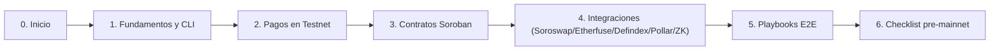

# Stellar Guide (Talleres en Español)

Guía visual y práctica para aprender **Stellar + Soroban** desde cero, con rutas por perfil, contratos listos, integraciones reales y playbooks de producto.

## Mapa rápido



## Qué encontrarás aquí

| Bloque | Qué resuelve | Dónde empezar |
|---|---|---|
| Fundamentos | Cuentas, red, CLI y flujos base | [docs/introduccion.md](docs/introduccion.md) |
| Pagos | Crear cuentas y enviar XLM | [exercises/01-pago-simple.md](exercises/01-pago-simple.md) |
| Contratos | Casos de negocio en Soroban | [docs/contratos-casos-uso.md](docs/contratos-casos-uso.md) |
| Integraciones | Conectar protocolos externos | [docs/integraciones-protocolos.md](docs/integraciones-protocolos.md) |
| Operación | Hardening y salida a producción | [docs/checklist-pre-mainnet.md](docs/checklist-pre-mainnet.md) |

## Rutas recomendadas (elige una)

### Ruta A: Primer contacto (90 min)
1. [docs/introduccion.md](docs/introduccion.md)
2. [docs/instalacion.md](docs/instalacion.md)
3. [docs/comandos-basicos.md](docs/comandos-basicos.md)
4. [docs/flujos-mermaid.md](docs/flujos-mermaid.md)
5. [exercises/01-pago-simple.md](exercises/01-pago-simple.md)

### Ruta B: Builder de contratos
1. [docs/guia-0-a-builder.md](docs/guia-0-a-builder.md)
2. [docs/contratos-casos-uso.md](docs/contratos-casos-uso.md)
3. `contracts/payroll`
4. `contracts/savings`
5. `contracts/loan`, `contracts/yield`, `contracts/nft-membership`

### Ruta C: Integraciones y producto
1. [docs/sep-estandares-anclas.md](docs/sep-estandares-anclas.md)
2. [docs/integraciones-protocolos.md](docs/integraciones-protocolos.md)
3. `examples/integrations/*`
4. [docs/playbooks-producto.md](docs/playbooks-producto.md)

## Estructura del repositorio

```text
docs/                    Guías, estándares, playbooks, operación
exercises/               Ejercicios prácticos
contracts/               Contratos Soroban listos para compilar y testear
examples/integrations/   Adapters y demos de integraciones externas
assets/                  Recursos visuales
```

## Contratos listos para practicar

| Contrato | Caso de uso | Estado |
|---|---|---|
| `contracts/payroll` | Dispersión de nómina por periodo | Listo |
| `contracts/savings` | Ahorro por metas con penalización temprana | Listo |
| `contracts/loan` | Préstamo colateralizado base | Listo |
| `contracts/yield` | Vault por shares (deposit/harvest/withdraw) | Listo |
| `contracts/nft-membership` | NFT de membresía/certificado | Listo |

## Integraciones listas para practicar

| Integración | Carpeta | Operaciones base |
|---|---|---|
| Soroswap | `examples/integrations/soroswap` | `healthcheck`, `quote`, `execute` |
| Etherfuse | `examples/integrations/etherfuse` | `lookupStablebonds`, `quoteOnramp`, `quoteOfframp` |
| Defindex | `examples/integrations/defindex` | `getApy`, `getBalance`, `deposit`, `withdraw` |
| Pollar | `examples/integrations/pollar` | `createSession`, `getRampQuote` |
| ZKProof | `examples/integrations/zkproof` | `generateProof`, `verifyLocal`, `verifyOnChainAttestation` |

## Quickstart (copiar y correr)

### 1) Integraciones (modo demo/mock)
```bash
cd examples/integrations
cp .env.example .env
npm install
INTEGRATIONS_USE_MOCK=true npm test
INTEGRATIONS_USE_MOCK=true npm run smoke:all
```

### 2) Contratos Soroban (tests)
```bash
cargo test -p payroll -p savings -p loan -p yield -p nft-membership
```

### 3) Pago rápido en Testnet
```bash
stellar tx new payment \
  --source <CUENTA_ORIGEN> \
  --destination <CUENTA_DESTINO_PUBLICA> \
  --asset native \
  --amount 100
```

## Referencias clave del repo

- Guía principal: [docs/guia-0-a-builder.md](docs/guia-0-a-builder.md)
- SEP y anclas: [docs/sep-estandares-anclas.md](docs/sep-estandares-anclas.md)
- Integraciones: [docs/integraciones-protocolos.md](docs/integraciones-protocolos.md)
- Playbooks E2E: [docs/playbooks-producto.md](docs/playbooks-producto.md)
- Checklist producción: [docs/checklist-pre-mainnet.md](docs/checklist-pre-mainnet.md)
- Troubleshooting: [docs/troubleshooting-integraciones.md](docs/troubleshooting-integraciones.md)

## Contrato desplegado (referencia)

| Contrato | ID | Enlaces |
|---|---|---|
| Dispersor de Nóminas | `CBM3OJUPURMLBUN563QN7I62J3SF4OYVIDDN3HPEROCQ3V4AL4VDEZXD` | [Stellar Lab](https://lab.stellar.org/r/testnet/contract/CBM3OJUPURMLBUN563QN7I62J3SF4OYVIDDN3HPEROCQ3V4AL4VDEZXD) · [Stellar Expert](https://stellar.expert/explorer/testnet/contract/CBM3OJUPURMLBUN563QN7I62J3SF4OYVIDDN3HPEROCQ3V4AL4VDEZXD) |

## Licencia

MIT
