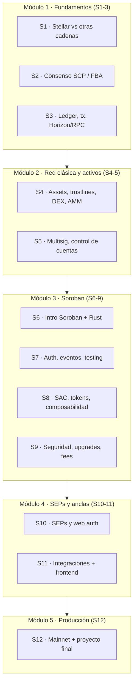

# Curso: Stellar & Soroban — De la Teoría a Producción

> Curso intensivo de **12 semanas** sobre la red Stellar y los contratos inteligentes Soroban.
> Diseñado para **desarrolladores con base en otra blockchain** (EVM/Solidity, Cosmos, Solana, etc.)
> que quieren dominar Stellar desde el mecanismo de consenso hasta el despliegue de contratos,
> SEPs y anclas (anchors).

Hecho por **Gerry Vela** · Material de clase en español.

---

## Cómo está organizado el curso

```text
course/
  README.md              ← estás aquí (mapa del curso)
  programa-docentes.md   ← guía pedagógica para profesores (cómo incorporar en sus materias)
  syllabus.md            ← programa completo de 12 semanas, evaluación y calendario
  teoria/                ← lecturas teóricas (consenso, arquitectura, comparativas)
  weeks/                 ← plan de clase semana por semana (semana-01..semana-12)
  evaluacion/            ← rúbricas, banco de quizzes y especificación del proyecto final
  recursos/              ← glosario, plantilla de slides y enlaces oficiales
```

El curso **reutiliza el repo práctico existente** como material de laboratorio:

| Recurso del repo | Se usa en |
|---|---|
| `docs/` | Lecturas de apoyo y referencia técnica |
| `exercises/` | Labs guiados de pagos |
| `contracts/` (campus, payroll, savings, loan, amm, yield, nft, food-trace) | Labs de Soroban (Módulo 3 y capacitación) |
| `presentacion/` | Decks HTML (docentes + sesión 1) |
| `docs/comandos-basicos.md` | Recetas CLI 25 (build / deploy / invoke) |
| `examples/integrations/` | Labs de integraciones (Módulo 4) |

---

## Mapa de módulos (12 semanas)



---

## Para profesores de Tecnología / Informática / Ingeniería

Si vas a **incorporar este material en una materia existente** (no necesariamente un curso de 12 semanas), empieza por:

**[programa-docentes.md](programa-docentes.md)** — formatos (cápsula 2–4 h, unidad 8–16 h, curso completo), mapa materia↔módulo, checklist del docente, evaluación reducida y proyectos por nivel.

**Presentación para docentes:** [`../presentacion/docentes.html`](../presentacion/docentes.html) — slides listas para proyectar (notas con tecla **N**).

## Para el instructor del curso intensivo (cómo usar este material)

Cada archivo `weeks/semana-XX.md` está listo para impartir y contiene:

1. **Objetivos de aprendizaje** medibles.
2. **Lecturas previas** (qué deben leer antes de llegar a clase).
3. **Guion de teoría** con puntos clave para la pizarra/slides.
4. **Callout "Vienes de EVM"** — la diferencia conceptual clave para tu audiencia.
5. **Demo en vivo** (qué proyectar paso a paso).
6. **Lab calificado** con entregable concreto.
7. **Tarea** para casa.
8. **Quiz** (al cierre de cada módulo).
9. **Recursos** oficiales.

Ritmo sugerido: **2 sesiones de ~90 min por semana** (1 teoría + 1 lab) o 1 sesión de 3h.

### Antes de la primera clase
- Pide a los estudiantes completar el **setup** ([../docs/instalacion.md](../docs/instalacion.md)).
- Comparte el [syllabus](syllabus.md) y la [rúbrica del proyecto final](evaluacion/proyecto-final.md) el día 1.
- Revisa la [plantilla de slides](recursos/plantilla-clase.md) para mantener consistencia visual.

---

## Para el estudiante (ruta de estudio)

1. Lee el [syllabus](syllabus.md) y completa el [setup](../docs/instalacion.md).
2. Cada semana: lee la teoría asignada → asiste → completa el lab → entrega la tarea.
3. Acumula tus labs en un portafolio (repo propio) — es parte de tu calificación.
4. Desde la **semana 6** empieza a pensar tu **proyecto final**.

## Evaluación (resumen)

| Componente | Peso |
|---|---|
| Quizzes por módulo (5) | 20% |
| Labs calificados (semanales) | 35% |
| Proyecto final | 35% |
| Participación / portafolio | 10% |

Detalle completo en [evaluacion/rubricas.md](evaluacion/rubricas.md).
