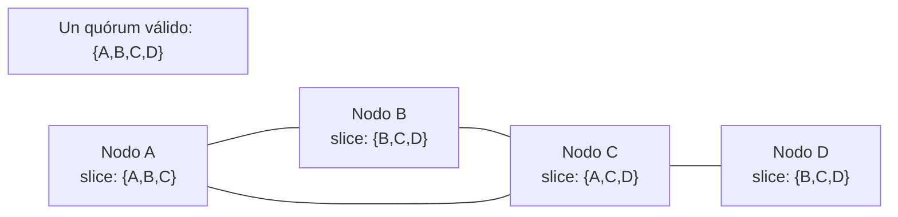
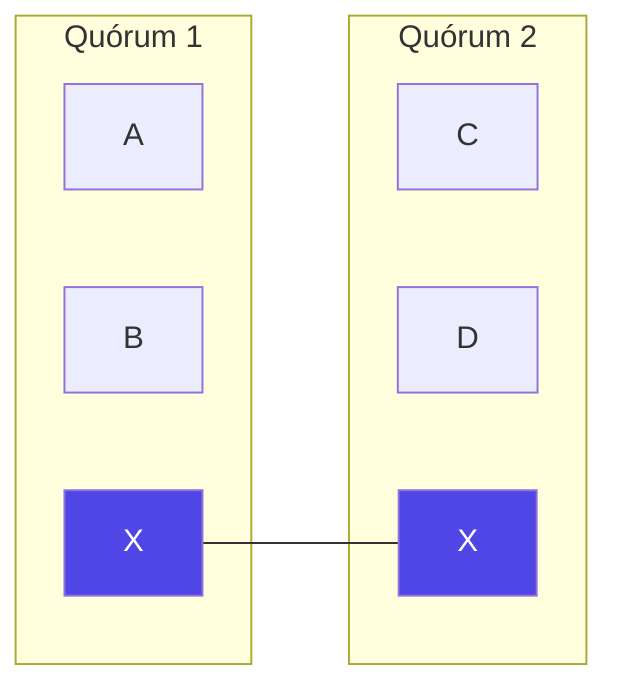
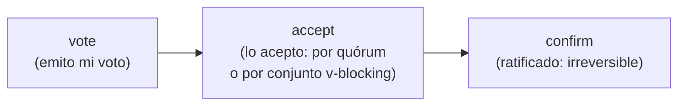
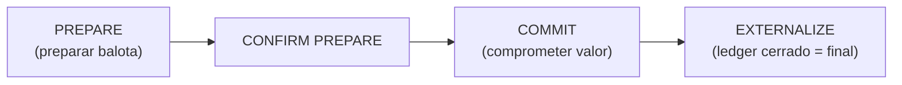
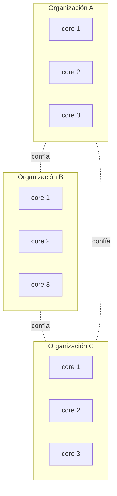

# Teoría · El Consenso de Stellar (SCP / Federated Byzantine Agreement)

> Lectura del **Módulo 1, Semana 2**. Este es el corazón teórico del curso.
> Si vienes de otra blockchain, aquí está la diferencia más profunda de Stellar.

---

## 1. El problema que resuelve cualquier consenso

Un sistema distribuido debe lograr que nodos independientes acuerden **un mismo valor** (el siguiente
bloque/ledger) aun cuando algunos nodos fallen o mientan (fallos *bizantinos*). Todo mecanismo de
consenso busca dos propiedades:

- **Safety (seguridad):** nodos honestos nunca acuerdan valores en conflicto (no hay forks).
- **Liveness (vivacidad):** el sistema sigue avanzando (cierra nuevos ledgers).

El teorema FLP y la realidad de las redes hacen imposible garantizar ambas perfectamente bajo
asincronía + fallos. **Cada protocolo elige un trade-off.** Entender qué eligió Stellar es la clave.

---

## 2. El panorama: cuatro familias de consenso

| Familia | Ejemplo | Membresía | Finalidad | Trade-off central |
|---|---|---|---|---|
| **PoW (Nakamoto)** | Bitcoin | Abierta | Probabilística (esperar confirmaciones) | Prioriza liveness; gasta energía; fork posible |
| **PoS** | Ethereum, Cosmos | Abierta (con stake) | Cercana a determinista | Seguridad ligada a capital en juego |
| **BFT clásico** | PBFT, Tendermint | **Cerrada y conocida** | Determinista, rápida | Requiere lista fija de validadores (3f+1) |
| **FBA (Stellar)** | SCP | **Abierta, sin lista global** | Determinista, rápida (~5 s) | Prioriza **safety**; puede bloquearse si la confianza está mal configurada |

La gran pregunta: **¿cómo logras BFT (finalidad rápida y determinista) sin una lista fija y central de
validadores?** Esa es la innovación de **FBA** y su instancia concreta, **SCP**.

> SCP fue formalizado por **David Mazières** (Stanford / SDF) en el whitepaper *"The Stellar Consensus
> Protocol: A Federated Model for Internet-level Consensus"* (2015).

---

## 3. La idea central: tú eliges en quién confías

En BFT clásico, *alguien* decide la lista de validadores y todos comparten los mismos quórums.
En FBA **no hay lista global**: **cada nodo declara individualmente en quién confía**. La red emerge de
esas decisiones locales que se solapan.

Dos conceptos hacen esto posible:

### Quorum slice (rebanada de quórum)
El conjunto de nodos que **un nodo concreto** considera suficiente para convencerse de un valor.
Es la declaración local de confianza de ese nodo. Un nodo puede tener varias slices.

> Analogía: para creer una noticia, a ti te basta con que la confirmen 2 de tus 3 fuentes de confianza.
> Esa "2 de 3" es tu quorum slice. Tu vecino puede tener fuentes distintas.

### Quorum (quórum)
Un conjunto de nodos que es **suficiente para que el sistema completo acuerde**: contiene al menos una
quorum slice de **cada** uno de sus miembros. El quórum no se impone globalmente; **emerge** de las
slices individuales.

---

## 4. Las dos garantías estructurales

### Quorum intersection (intersección de quórums)
Para que haya **safety**, dos quórums cualesquiera de nodos bien comportados deben **compartir al menos un
nodo honesto**. Si dos quórums *no* se intersectan, la red puede **forkearse** (cada lado acuerda algo
distinto). Por eso la configuración de quórums importa tanto: una mala topología rompe la seguridad.

*El nodo compartido **X** es lo que evita el fork.*

### Conjunto v-blocking (de bloqueo)
Un conjunto **v-blocking** para un nodo es un conjunto que **interseca todas** sus quorum slices. Si todos
los nodos de un conjunto v-blocking afirman algo, el nodo no puede ignorarlo. Este mecanismo permite que la
verdad se propague aun cuando un nodo todavía no tenga un quórum completo a favor.

---

## 5. Cómo vota la red: federated voting

SCP construye el acuerdo con un proceso de **voto federado** de 3 estados sobre cada afirmación:

- **vote:** el nodo propone/apoya un valor (y promete no contradecirlo).
- **accept:** el nodo lo acepta si un **quórum** vota a favor **o** si un conjunto **v-blocking** ya lo aceptó.
- **confirm:** cuando un quórum *acepta*, el valor queda **ratificado** — ya no puede revertirse.

---

## 6. El protocolo completo: nominación + balotaje

Cada cierre de ledger, SCP corre en dos fases:

### Fase 1 — Nominación
Los nodos proponen valores candidatos (conjuntos de transacciones). Mediante voto federado **convergen**
a un conjunto común de candidatos. Produce un valor compuesto sobre el cual se votará. La nominación está
diseñada para **dejar de producir** nuevos candidatos una vez que converge, dando estabilidad.

### Fase 2 — Balotaje (ballot protocol)
Sobre el valor nominado se ejecuta el protocolo de balotas para garantizar acuerdo irreversible. Cada
balota es `(contador, valor)` y pasa por estados de voto federado:

- **PREPARE:** se vota preparar una balota (abortando balotas menores en conflicto).
- **COMMIT:** una vez confirmada la preparación, se vota comprometer el valor.
- **EXTERNALIZE:** confirmado el commit, el valor es **definitivo**. El ledger se cierra.

El contador de balota permite reintentar (subir de balota) si el progreso se estanca, **sin** sacrificar
safety. Por eso SCP, ante mala configuración o partición, prefiere **bloquearse** (esperar) antes que
forkearse.

> **Punto clave para el examen:** SCP **prioriza safety sobre liveness**. Es lo opuesto a Bitcoin, que
> siempre avanza (liveness) aceptando forks temporales (safety probabilística). En Stellar, una vez que
> un ledger se *externaliza*, es **final** — no hay reorganizaciones.

---

## 7. En la práctica: validadores, organizaciones y tiers

- Cada validador corre `stellar-core` con un **quorum set** configurado: umbral + miembros + conjuntos
  internos anidados (`innerQuorumSets`).
- Los validadores se agrupan por **organización**; se recomienda no depender de un solo nodo por org
  (para tolerar fallos de un nodo sin perder la org).
- **Tier 1:** un grupo de organizaciones de alta disponibilidad y reputación cuya inclusión mutua sostiene
  la salud de la red. La **Stellar Development Foundation (SDF)** es una de ellas, pero la red está
  diseñada para **no depender** de ningún actor único.
- No hay **minería ni recompensas de bloque**: validar es un servicio que las organizaciones prestan por
  su propio interés en la red. Esto hace a Stellar **energéticamente eficiente** y de **baja latencia**
  (~5 s por ledger).

---

## 8. "Vienes de EVM / PoW / PoS" — qué cambia

| Concepto | EVM (PoW/PoS) | Stellar (SCP/FBA) |
|---|---|---|
| Quién valida | Mineros / stakers globales | Nodos que **otras orgs eligen confiar** |
| Finalidad | Probabilística / ~epoch | **Determinista, ~5 s**, sin reorgs |
| Energía / capital | Alta (PoW) / stake bloqueado (PoS) | Mínima; sin stake ni minería |
| Forks temporales | Posibles | **No** (prefiere bloquearse) |
| Membresía | Abierta por recurso (hash/stake) | Abierta por **confianza declarada** |
| Riesgo principal | Ataque 51% / costo de stake | **Mala configuración de quórums** (sin intersección) |

El cambio mental: en Stellar **la seguridad no se compra con hash ni stake; se construye con confianza
solapada bien configurada**. El "ataque" más relevante no es económico, es topológico.

---

## 9. Preguntas de comprensión (autoevaluación)

1. Diferencia entre *quorum slice* y *quorum*.
2. ¿Por qué la intersección de quórums es condición de safety?
3. ¿Qué es un conjunto v-blocking y para qué sirve?
4. ¿Por qué SCP puede "bloquearse" y por qué eso es preferible a forkearse?
5. Explica los estados del voto federado: vote → accept → confirm.
6. ¿En qué se diferencia la finalidad de Stellar respecto a la de Bitcoin?

---

## Recursos

- Whitepaper SCP (Mazières, 2015): https://www.stellar.org/papers/stellar-consensus-protocol
- Docs oficiales — Stellar Consensus Protocol: https://developers.stellar.org/docs/learn/fundamentals/stellar-consensus-protocol
- Visualización interactiva de SCP (buscar "SCP visual" en developers.stellar.org)

> Continúa con [03-arquitectura-red-y-ledger.md](03-arquitectura-red-y-ledger.md).
