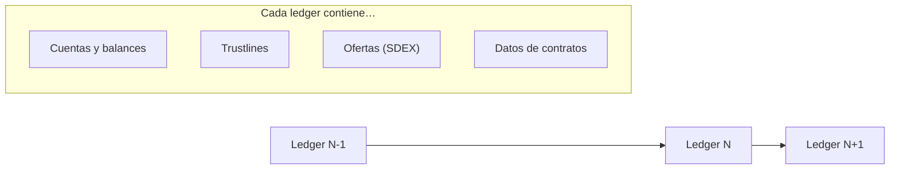
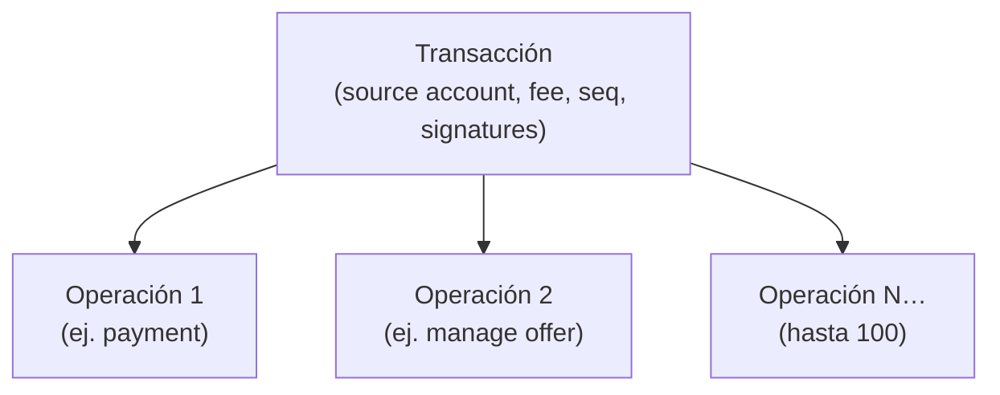
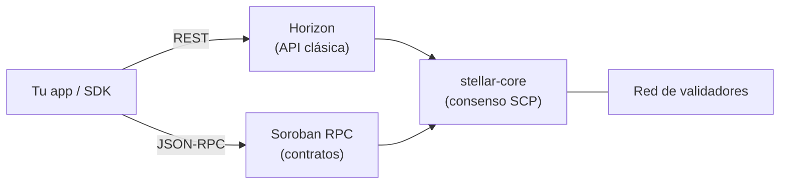
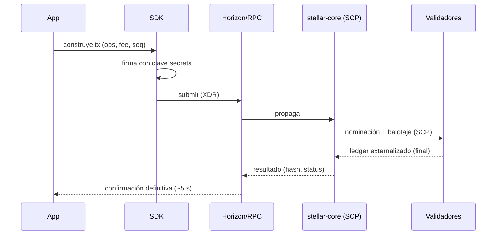

# Teoría · Arquitectura de la red, ledger, transacciones y APIs

> Lectura del **Módulo 1, Semana 3**. Conecta la teoría de consenso con lo que tocarás en código.

---

## 1. El ledger: el "estado mundial" de Stellar

Cada ~5 segundos la red **cierra un ledger** (el equivalente a un bloque). El ledger contiene el estado
actual de todo: cuentas, balances, trustlines, ofertas, datos de contrato, etc. Cada ledger referencia al
anterior por hash, formando una cadena verificable.

- **Ledger header:** hash del anterior, secuencia, timestamp, fee base, versión de protocolo.
- **Finalidad:** una vez externalizado por SCP, es **definitivo** (sin reorgs).
- **History archives:** copias públicas del historial para que nuevos nodos se sincronicen.

---

## 2. Jerarquía: Transacción → Operaciones

Esta es una distinción central de Stellar:

- Una **transacción** agrupa **1..100 operaciones** y es **atómica**: o se aplican todas o ninguna.
- La transacción tiene: cuenta origen, **fee** (= fee base × nº de operaciones), **número de secuencia**
  (anti-replay), límites de tiempo (`timebounds`) y **firmas**.
- Las **operaciones** son las acciones concretas. Tipos clásicos: `payment`, `createAccount`,
  `changeTrust`, `manageBuyOffer/manageSellOffer`, `pathPaymentStrictSend/Receive`, `setOptions`
  (signers/thresholds), `manageData`, `createClaimableBalance`, `clawback`, e `invokeHostFunction`
  (la operación que ejecuta contratos Soroban).

> **Vienes de EVM:** allí una tx = una llamada. En Stellar una tx puede empacar varias acciones atómicas
> sin necesidad de un contrato "multicall".

---

## 3. Fees, secuencia y anti-spam

- **Fee base:** 100 stroops por operación (1 XLM = 10,000,000 stroops). Una tx con 3 ops ≈ 300 stroops base.
- **Surge pricing:** si un ledger se satura, las tx compiten por fee; las de mayor fee entran primero.
- **Número de secuencia:** cada cuenta lleva un contador; cada tx debe usar el siguiente. Evita replays y
  ordena las transacciones de una cuenta.
- **Reservas mínimas:** mantener cuenta/estado bloquea XLM (anti-spam de estado), no lo gasta.

Para Soroban, además, el fee incluye **recursos**: instrucciones de CPU, bytes leídos/escritos en ledger,
tamaño de la entrada y **rent** por el TTL del estado (Módulo 3).

---

## 4. Cómo hablas con la red: Horizon vs Soroban RPC

| | **Horizon** | **Soroban RPC** |
|---|---|---|
| Estilo | REST + streaming | JSON-RPC |
| Para qué | Flujos clásicos: cuentas, pagos, trustlines, ofertas, historial | Contratos: simular, enviar `invokeHostFunction`, leer estado de contrato |
| Cuándo | Apps de pagos/activos | Apps con Soroban |
| Recomendación actual | Sigue siendo útil para historial y clásico | **Preferido para apps nuevas con contratos** |

Muchas apps usan **ambos**: RPC para contratos, Horizon para historial/cuentas.

---

## 5. SDKs y herramientas

- **Stellar CLI (`stellar`):** despliegue/invocación de contratos, gestión de identidades, pagos. Tu
  herramienta principal en clase. ([../../docs/comandos-basicos.md](../../docs/comandos-basicos.md))
- **SDKs:** JavaScript/TypeScript (`@stellar/stellar-sdk`), Python, Go, Rust, entre otros.
- **Friendbot:** fondea cuentas de Testnet gratis.
- **Stellar Lab:** UI para construir/firmar/enviar transacciones y explorar.
- **Stellar Expert:** explorador de bloques/activos/contratos.

---

## 6. Testnet vs Mainnet vs Futurenet

| Red | Uso | Dinero real | Reset |
|---|---|---|---|
| **Testnet** | Aprender y probar (todo el curso) | No (Friendbot) | Se resetea periódicamente |
| **Futurenet** | Probar features muy nuevas de Soroban | No | Variable |
| **Mainnet** | Producción | **Sí** | Nunca |

Cada red tiene su **passphrase** distinta; firmar para la red equivocada falla por diseño.

---

## 7. El recorrido de una transacción (de extremo a extremo)

El **XDR** (External Data Representation) es el formato binario en que se serializan transacciones y
resultados. La CLI y los SDKs lo manejan por ti, pero lo verás en exploradores y logs.

---

## 8. Preguntas de comprensión

1. ¿Cuál es la diferencia entre transacción y operación? ¿Por qué importa la atomicidad?
2. ¿Para qué sirve el número de secuencia?
3. ¿Cuándo usarías Horizon y cuándo Soroban RPC?
4. ¿Qué es la reserva mínima y qué problema previene?
5. ¿Por qué firmar para la red equivocada falla?

## Recursos

- Fundamentos en docs oficiales: https://developers.stellar.org/docs/learn/fundamentals
- Referencia de operaciones y transacciones: https://developers.stellar.org/docs/learn/fundamentals/transactions
- Apoyo del repo: [../../docs/introduccion.md](../../docs/introduccion.md), [../../docs/flujos-mermaid.md](../../docs/flujos-mermaid.md)
