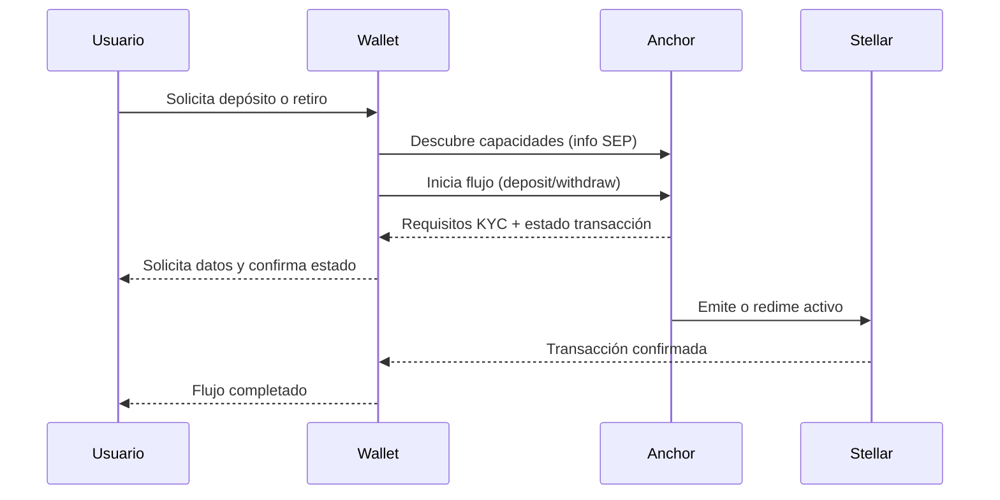

# SEP, Estándares y Anclas en Stellar

Esta guía explica cómo se conectan los **SEP (Stellar Ecosystem Proposals)** con el trabajo práctico de integraciones de pago y emisión de activos, especialmente cuando intervienen **anclas**.

## Qué es un SEP

Un SEP es una propuesta/estándar de interoperabilidad del ecosistema Stellar. En la práctica, te permite implementar flujos comunes (depósitos, retiros, KYC, cotizaciones, web auth) de forma compatible con wallets y servicios que ya siguen esos estándares.

- **SEP de interoperabilidad**: definen endpoints, formatos y semántica para integraciones entre wallets, anclas y servicios.
- **Objetivo**: evitar integraciones ad-hoc por cada partner.

## Qué es un ancla (anchor)

Un **ancla** es una entidad que conecta dinero del mundo real (fiat u otros activos) con activos en Stellar.

- **Depósito**: el usuario entrega fiat al ancla y recibe activo tokenizado en Stellar.
- **Retiro**: el usuario devuelve el activo tokenizado y el ancla entrega fiat fuera de la red.

## Flujo operativo típico (wallet + ancla + SEP)

## SEP clave que debes conocer

> Nota: esta lista es práctica para talleres e integraciones iniciales.

- **SEP-1**: metadatos de ecosistema y descubrimiento básico de servicios.
- **SEP-6**: depósitos y retiros con anclas vía API.
- **SEP-10**: autenticación basada en challenge transaction (Web Auth).
- **SEP-12**: gestión de información de cliente/KYC.
- **SEP-24**: flujo interactivo (normalmente web) para depósitos/retiros.
- **SEP-31**: pagos entre instituciones.
- **SEP-38**: cotizaciones de precio (quotes) para intercambio/conversión.

## Cómo elegir SEP según caso de uso

- **Wallet simple con on/off ramp**: SEP-6 + SEP-10 + SEP-12.
- **Experiencia embebida e interactiva**: SEP-24 + SEP-10 + SEP-12.
- **Pagos institution-to-institution**: SEP-31 (y normalmente SEP-12/10).
- **Necesidad de cotización previa y lock de precio**: SEP-38.

## Checklist de implementación para el repo

1. Definir caso de uso principal (depósito, retiro, pagos B2B, quotes).
2. Elegir SEP mínimos para el MVP.
3. Modelar flujo con Mermaid (happy path + errores comunes).
4. Documentar contratos de API (request/response esperados).
5. Incluir estrategia de autenticación y KYC.
6. Definir observabilidad (logs, estados y conciliación).

## Buenas prácticas

- Mantener separación entre red de pruebas y producción.
- Nunca exponer secretos en documentación o commits.
- Versionar ejemplos de payloads y errores de API.
- Agregar matrices de compatibilidad de SEP por proveedor/ancla.
- Incluir runbooks de incidentes para depósitos/retiros.

## Anclas de documentación sugeridas

En los documentos del repositorio conviene usar secciones estables para enlazar desde materiales del taller:

- `#qué-es-un-sep`
- `#qué-es-un-ancla-anchor`
- `#sep-clave-que-debes-conocer`
- `#cómo-elegir-sep-según-caso-de-uso`
- `#checklist-de-implementación-para-el-repo`

Así puedes referenciar rápidamente partes de esta guía desde otros documentos y slides.
