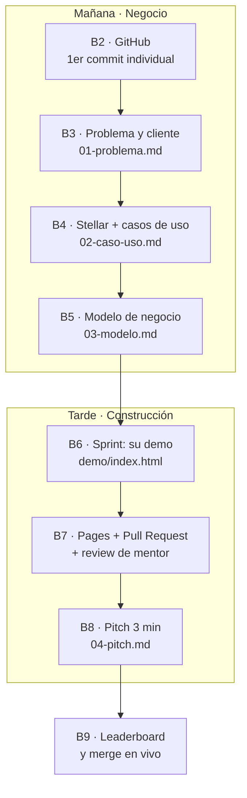

# Ideathon Stellar × BAF × CANACINTRA

Material completo para correr un **ideathon de 1 día (8 h)** con estudiantes universitarios, donde cada equipo sale con **una demo publicada en internet** y la participación se mide con **commits reales**.

**Repo del evento:** [github.com/MarxMad/Ideathon-Stellar-BAF-Canacintra](https://github.com/MarxMad/Ideathon-Stellar-BAF-Canacintra)

> **La idea central:** no se enseña a programar — se enseña a convertir un dolor real de la industria en una propuesta ejecutable, y GitHub es donde esa propuesta se escribe, se versiona y se defiende. El commit no es un adorno: es la evidencia auditable de que el equipo trabajó.

---

## Por dónde empezar

| Si eres… | Lee |
|---|---|
| **Organizador** | [temario.md](temario.md) → [metricas.md](metricas.md) → [logistica.md](logistica.md) |
| **Cliente / patrocinador** | [plan-de-trabajo.html](plan-de-trabajo.html) — el temario en formato presentable |
| **Facilitador / mentor** | [guia-facilitador.md](guia-facilitador.md) + [rubrica.md](rubrica.md) |
| **Participante** | [guia-github-participantes.md](guia-github-participantes.md) |
| **Jurado** | [rubrica.md](rubrica.md) |

---

## Contenido

```text
ideathon/
├── temario.md                    ← agenda de 8 h, bloque por bloque, con contenidos
├── plan-de-trabajo.html          ← el temario como página (ábrelo con doble clic)
├── metricas.md                   ← qué se mide, cómo y con qué comando (el corazón del diseño)
├── rubrica.md                    ← evaluación del jurado + evaluación automática desde Git
├── logistica.md                  ← checklist T-2 semanas, T-72 h, día del evento y contingencias
├── guia-facilitador.md           ← cómo correr el día sin que se caiga la métrica
├── guia-github-participantes.md  ← paso a paso para el asistente (todo desde el navegador)
├── plantillas/                   ← los 5 entregables, ficha de participante
│   └── demo/index.html           ← plantilla de la página que publican (marcada con ✏️)
├── repo-participantes/           ← semilla del repo público del evento (README, CI, PR template, ejemplo)
└── scripts/
    ├── crear-repo.sh             ← publica el repo del ideathon en GitHub, ya configurado
    └── metricas.sh               ← reporte y leaderboard de commits
```

> Los enlaces internos de `repo-participantes/` (a `plantillas/`, `guia-github.md` y `rubrica.md`) se ven
> rotos aquí a propósito: `crear-repo.sh` copia esos archivos dentro del repo publicado, donde sí resuelven.

---

## El diseño en una imagen



Cada bloque cierra con un archivo, y cada archivo es un commit. Un equipo que trabaja el día completo acumula 5–8 commits y 1 Pull Request; cada asistente acumula mínimo el suyo.

---

## Montarlo en 4 pasos

```bash
# 1. Publicar el repo del evento (público, ya configurado con merge commits, CI y Pages)
./ideathon/scripts/crear-repo.sh MarxMad/Ideathon-Stellar-BAF-Canacintra

# 2. Ensayar el flujo completo con una cuenta de GitHub ajena:
#    fork → commit → copiar la plantilla de demo → activar Pages → PR
#    (imprescindible: con tu cuenta no ves las fricciones que sí ve un estudiante)

# 3. El día del evento, proyectar el leaderboard
./ideathon/scripts/metricas.sh MarxMad/Ideathon-Stellar-BAF-Canacintra --leaderboard
```

---

## Métricas del evento (resumen)

| ID | Métrica | Meta |
|---|---|---|
| M1 | Asistentes con commit propio | **100 %** |
| M3 | Equipos con ≥ 4 commits | 100 % |
| M4 | Pull Requests abiertos | 1 por equipo |
| M5 | Pull Requests mergeados | ≥ 80 % |
| M6 | Equipos que iteraron tras el review | ≥ 50 % |
| M7 | Equipos con demo publicada en Pages | **100 %** |
| M9 | Equipos con evidencia en Testnet | ≥ 30 % |

Detalle y comandos en [metricas.md](metricas.md).

---

## Relación con el resto del repo

El ideathon **reutiliza el material que ya existe** en Stellar-Guide como catálogo de casos de uso y como soporte técnico del sprint:

| Recurso | Se usa en |
|---|---|
| [`docs/contratos-casos-uso.md`](../docs/contratos-casos-uso.md) | B4 — catálogo dolor → patrón |
| [`docs/playbooks-producto.md`](../docs/playbooks-producto.md) | B4 — combinaciones end-to-end |
| [`docs/sep-estandares-anclas.md`](../docs/sep-estandares-anclas.md) | B4 — anclas y puente al sistema financiero |
| [`contracts/`](../contracts) | B4 y B6 — contratos de referencia por caso de uso |
| [`exercises/01-pago-simple.md`](../exercises/01-pago-simple.md) | B6 — nivel N2 (Testnet) |
| [`docs/comandos-basicos.md`](../docs/comandos-basicos.md) | B6 — nivel N3 (desplegar contrato) |
| [`frontend/`](../frontend) y [`docs/frontend-contratos.md`](../docs/frontend-contratos.md) | B6 — nivel N3 (UI conectada a un contrato) |
| [`course/`](../course/README.md) | B9 — ruta de continuación para quien quiera profundizar |
