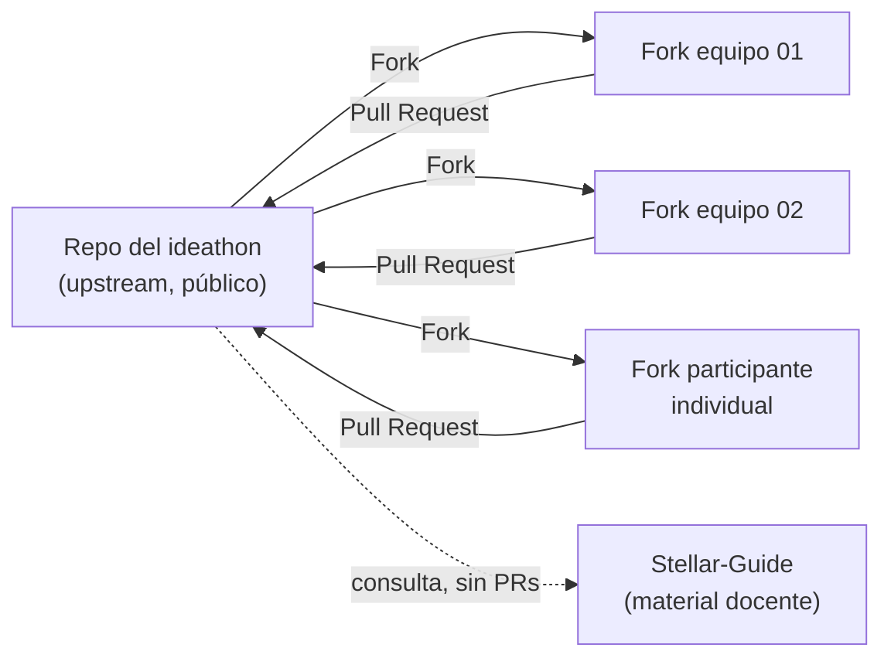

# Métricas del Ideathon — cómo medir con commits

El objetivo declarado del evento es **"que los asistentes hagan commits medibles"**. Este documento define qué se mide, cómo se captura y con qué comando se obtiene.

---

## Decisión de arquitectura: repo dedicado + fork/PR

**Se usa un repo nuevo, público y separado:** [`github.com/MarxMad/Ideathon-Stellar-BAF-Canacintra`](https://github.com/MarxMad/Ideathon-Stellar-BAF-Canacintra).

| Opción | Por qué sí / por qué no |
|---|---|
| ✅ **Repo dedicado + fork/PR** | Todo commit del repo es del ideathon → la métrica no necesita filtros. Los participantes no requieren permisos de escritura. El historial queda como evidencia entregable a CANACINTRA. |
| ❌ Carpeta dentro de Stellar-Guide | Mezcla material docente con entregables de participantes; ensucia issues, PRs y el historial del repo con el que se da clase. |
| ❌ GitHub Classroom | Métricas automáticas, pero exige organización configurada y tiempo de setup que no rinde en un evento de un día. |
| ❌ Un repo por equipo | Más ownership, pero la métrica se dispersa en N repos y hay que rastrearlos uno por uno. |

**Stellar-Guide se enlaza como material de consulta** desde el repo del ideathon. No recibe PRs de participantes.



---

## Tabla de métricas

| ID | Métrica | Qué demuestra | Cómo se mide | Meta |
|---|---|---|---|---|
| **M0** | Cuenta de GitHub creada y verificada | Onboarding completado | Registro de asistencia con usuario de GitHub | 100 % |
| **M1** | **Primer commit individual** | Cada persona contribuyó con su nombre | 1 archivo en `participantes/` por usuario | **100 % de asistentes** |
| **M2** | Fork del repo | El equipo entró al flujo de trabajo | `gh api repos/O/R/forks` | 1 por equipo |
| **M3** | ≥ 4 commits del equipo | Trabajo distribuido en el día, no volcado al final | Commits en la rama del PR | 100 % de equipos |
| **M4** | Pull Request abierto | Entregable propuesto formalmente | `gh pr list` | 1 por equipo |
| **M5** | **PR mergeado** | Entregable completo y aprobado | `gh pr list --state merged` | ≥ 80 % de equipos |
| **M6** | Commit posterior al review | Capacidad de iterar con retroalimentación | Commits con fecha > primer comentario de review | ≥ 50 % de equipos |
| **M7** | **Demo publicada en GitHub Pages** | El equipo produjo algo que se puede usar, no solo leer | URL viva en `evidencia.md` + carpeta `demo/` en el PR | **100 % de equipos** |
| **M9** | Evidencia en Testnet (bonus) | Ejecución técnica real | Hash de tx o contract ID en `evidencia.md` | ≥ 30 % de equipos |
| **M8** | Personas distintas como autoras | Que no commitee solo "el técnico" del equipo | Autores únicos en el historial | ≥ 60 % de asistentes con 2+ commits |

**Reporte final para CANACINTRA:** asistentes, cuentas creadas, commits totales, autores únicos, PRs abiertos/mergeados, **demos publicadas con su URL** y % de equipos con evidencia de Testnet. Todo verificable públicamente en el historial de un repo — es una métrica auditable, no una encuesta de satisfacción.

---

## Dos detalles que rompen la métrica si no se cuidan

### 1. Mergear con *merge commit*, nunca con *squash*

GitHub ofrece tres formas de mergear un PR. **Squash and merge colapsa los N commits del equipo en uno solo** y lo atribuye a quien mergea o al autor del PR: pierdes la autoría individual de cada participante, que es justo lo que estás midiendo.

> **Configura el repo así:** Settings → General → Pull Requests → deja habilitado **solo** *Allow merge commits*. Desactiva *Allow squash merging* y *Allow rebase merging*. Con eso no depende de que el mentor recuerde elegir bien a las 17:40.

### 2. Coautoría para commits de equipo

Cuando un equipo trabaja sobre un solo fork, quien guarda el archivo se lleva el commit. Para repartir crédito, en el campo de descripción del commit (web UI) se agregan al final, tras una línea en blanco:

```
Co-authored-by: Nombre <usuario@users.noreply.github.com>
Co-authored-by: Otro Nombre <otro@users.noreply.github.com>
```

GitHub muestra a los coautores en el commit. Nota: los coautores aparecen en la interfaz del commit, pero **no** cuentan como autor en la API de commits, así que la métrica M1 sigue apoyándose en el archivo individual de `participantes/` — que es la razón por la que ese ritual existe.

---

## Cómo se obtienen los números

Todo se saca con `gh` (GitHub CLI) autenticado. El script está en [`scripts/metricas.sh`](scripts/metricas.sh):

```bash
# Reporte completo del evento
./ideathon/scripts/metricas.sh MarxMad/Ideathon-Stellar-BAF-Canacintra

# Solo el leaderboard, para proyectar en el bloque B9
./ideathon/scripts/metricas.sh MarxMad/Ideathon-Stellar-BAF-Canacintra --leaderboard
```

Comandos sueltos útiles durante el día:

```bash
REPO=MarxMad/Ideathon-Stellar-BAF-Canacintra

# Commits por autor en main (después de mergear)
gh api "repos/$REPO/commits?per_page=100" --paginate \
  --jq '.[].author.login // "sin-cuenta"' | sort | uniq -c | sort -rn

# PRs abiertos y su estado
gh pr list --repo "$REPO" --state all \
  --json number,title,author,state,commits \
  --jq '.[] | "\(.number)\t\(.state)\t\(.author.login)\t\(.commits|length) commits\t\(.title)"'

# Commits dentro de un PR (funciona aunque aún no esté mergeado)
gh api "repos/$REPO/pulls/<N>/commits" --jq '.[].author.login' | sort | uniq -c

# Forks creados (M2)
gh api "repos/$REPO/forks?per_page=100" --paginate --jq '.[].owner.login' | sort -u | wc -l
```

### 3. Las demos se publican desde el fork, no desde el repo principal

Cada equipo activa GitHub Pages en **su propio fork** (*Settings → Pages → `main` / `(root)`*), así tienen URL viva antes del merge y antes del pitch. Una vez mergeado el PR, la misma demo queda también bajo el repo principal, que es la copia permanente.

> **Sobre los forks:** mientras el PR no se mergea, los commits viven en el fork y **no** aparecen en el historial del repo principal ni en la gráfica de contribuciones del upstream. Por eso M3 se mide sobre `pulls/<N>/commits` y no sobre `commits` de main. Al mergear (con merge commit), esos commits sí entran al historial principal con su autor original.

---

## Cómo se comunica a los participantes

La tabla de métricas se proyecta en el bloque de apertura y se deja visible en una pantalla lateral todo el día. Es deliberado: la gente trabaja hacia lo que se mide en público, y aquí lo que se premia —commits frecuentes, autoría repartida, respuesta al review— es exactamente el comportamiento que se quiere enseñar.

El **premio "Equipo más constante"** existe por esta razón: separa la calidad de la idea (que el jurado juzga) de la disciplina de trabajo (que el historial de Git juzga solo).
