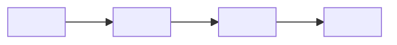

# 02 · Caso de uso Stellar

> Bloque B4. Catálogo de referencia: `docs/contratos-casos-uso.md` y `docs/playbooks-producto.md` del repo Stellar-Guide.

## Test de 4 preguntas: ¿esto justifica blockchain?

| # | Pregunta | Sí/No | Justificación (1 línea) |
|---|---|---|---|
| 1 | ¿Hay varias partes que no confían plenamente entre sí y necesitan el mismo registro? | `<...>` | `<...>` |
| 2 | ¿El registro debe ser auditable por un tercero (cliente, auditor, autoridad)? | `<...>` | `<...>` |
| 3 | ¿El valor cruza fronteras o monedas? | `<...>` | `<...>` |
| 4 | ¿Automatizar la liquidación elimina un intermediario caro o lento? | `<...>` | `<...>` |

**Puntaje: `<X>`/4** — con menos de 2, el equipo debe replantear el problema o proponer la solución sin blockchain (y decirlo abiertamente: eso suma con el jurado).

## Patrón elegido

- **Patrón:** `<pagos transfronterizos / dispersión / escrow / crédito-factoraje / trazabilidad / ahorro / membresías / votación>`
- **Contrato de referencia del catálogo:** `<contracts/xxx>`
- **Por qué este y no otro:** `<...>`

## Qué pasa on-chain y qué se queda off-chain

| On-chain (en Stellar) | Off-chain (base de datos, ERP, papel) |
|---|---|
| `<...>` | `<...>` |
| `<...>` | `<...>` |

> Regla práctica: on-chain va lo que necesita ser **verificable por otros** o **mover valor**. Todo lo confidencial (datos personales, precios negociados, documentos) se queda fuera; a lo mucho se guarda su hash.

## Flujo de la solución

## Qué NO vamos a resolver

- `<...>`
- `<...>`
