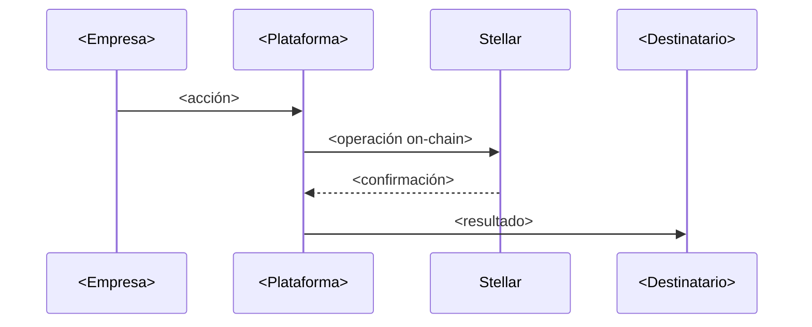

# Evidencia de ejecución

> Bloque B6. N1 es obligatorio; N2 y N3 son bonus. Los tres terminan con la página publicada.

## 🔗 Nuestra demo en vivo

**URL:** `https://<usuario>.github.io/Ideathon-Stellar-BAF-Canacintra/ideas/equipo-XX/demo/`

> Se activa en el fork: *Settings → Pages → Deploy from a branch → `main` / `(root)` → Save*.
> Tarda un par de minutos en aparecer. Esta liga va en el pitch.

## Nivel alcanzado

- [ ] **N1 · Su página** — plantilla personalizada con su idea, sus cifras y sus colores
- [ ] **N2 · Demo interactiva** — los pasos del simulador reescritos con su propio flujo
- [ ] **N3 · Conectada a Stellar** — la página consulta o ejecuta algo real en Testnet

---

## N1 · Qué cambiamos de la plantilla

- **Nombre de la idea:** `<...>`
- **Color de marca:** `<código hex>`
- **Las tres cifras del problema:** `<...>`
- **Qué nos costó más trabajo:** `<...>`

## Diagrama del flujo

---

## N2 · Nuestro flujo en el simulador

| Paso | Actor | Qué pasa | ¿En Stellar? |
|---|---|---|---|
| 1 | `<...>` | `<...>` | `<sí/no>` |
| 2 | `<...>` | `<...>` | `<sí/no>` |
| 3 | `<...>` | `<...>` | `<sí/no>` |
| 4 | `<...>` | `<...>` | `<sí/no>` |

---

## N3 · Evidencia en Testnet

- **Cuenta pública (G...):** `<...>`
- **Hash de la transacción o Contract ID (C...):** `<...>`
- **Link al explorador:** `https://stellar.expert/explorer/testnet/tx/<hash>`
- **Qué demuestra:** `<...>`

> Guías: `exercises/01-pago-simple.md` y `docs/frontend-contratos.md` en Stellar-Guide.
> ⚠️ Nunca peguen una clave secreta (las que empiezan con `S`) en la página: es pública.
