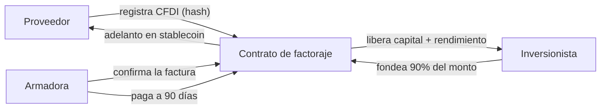

# 02 · Caso de uso Stellar

> ⚠️ Ejemplo de referencia.

## Test de 4 preguntas: ¿esto justifica blockchain?

| # | Pregunta | Sí/No | Justificación |
|---|---|---|---|
| 1 | ¿Varias partes que no confían plenamente y necesitan el mismo registro? | **Sí** | Proveedor, armadora (que confirma la factura) e inversionistas que financian. Hoy cada uno lleva su propio registro. |
| 2 | ¿El registro debe ser auditable por un tercero? | **Sí** | El inversionista necesita verificar que esa factura no fue financiada dos veces — el fraude clásico del factoraje. |
| 3 | ¿El valor cruza fronteras o monedas? | **Sí** | Parte de los inversionistas serían extranjeros; la armadora liquida en dólares. |
| 4 | ¿Automatizar la liquidación elimina un intermediario caro? | **Sí** | El pago al inversionista se libera solo cuando entra el pago de la armadora, sin conciliación manual. |

**Puntaje: 4/4**

## Patrón elegido

- **Patrón:** crédito/factoraje con liberación condicionada (combinación de préstamo colateralizado + escrow).
- **Contrato de referencia:** `contracts/loan` para la posición de financiamiento, `contracts/escrow` para la liberación al cobrarse la factura.
- **Por qué este y no otro:** la factura funciona como colateral y el disparador del pago es un evento externo (la armadora pagó). Eso es exactamente custodia condicionada, no una simple transferencia.

## Qué pasa on-chain y qué se queda off-chain

| On-chain (en Stellar) | Off-chain |
|---|---|
| Hash del CFDI y su UUID (prueba de existencia y unicidad) | El CFDI completo, con montos y datos fiscales |
| Estado de la factura: registrada → financiada → cobrada | Expediente KYC del proveedor y del inversionista |
| Monto financiado, tasa y fecha de vencimiento | Contrato de cesión de derechos firmado |
| Liberación del pago al inversionista | Conciliación bancaria con el pago real de la armadora |

> La unicidad es la clave: registrar el hash del UUID on-chain impide que la misma factura se financie dos veces con dos financieras distintas, que es la pérdida más común del sector.

## Flujo de la solución

## Qué NO vamos a resolver

- La conversión a pesos en cuenta bancaria: depende de un ancla regulada, no la construimos nosotros.
- La calificación crediticia de la armadora: se asume investment grade.
- La firma legal de la cesión de derechos: sigue siendo un proceso off-chain con firma electrónica.
