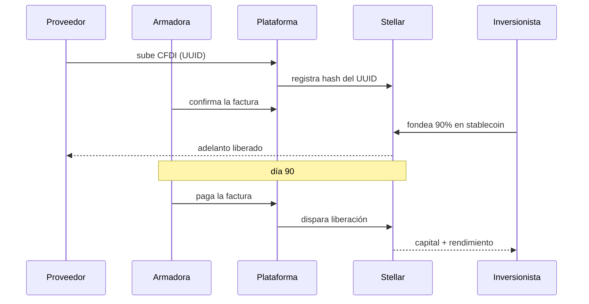

# Evidencia de ejecución

> ⚠️ Ejemplo de referencia.

## Nivel alcanzado

- [x] **N1 · Diseño** — diagrama del flujo + pantallas
- [x] **N2 · Testnet** — pago real ejecutado en la red de pruebas
- [ ] **N3 · Contrato** — contrato desplegado e invocado en Testnet

---

## N1 · Diagrama de la solución

**Pantallas / mockup:**
1. *Subir factura* — el proveedor arrastra el XML del CFDI y ve la oferta de adelanto en 10 segundos.
2. *Mercado de facturas* — el inversionista ve facturas confirmadas, plazo, tasa y armadora.
3. *Estado de cobro* — semáforo por factura: registrada / financiada / cobrada.

---

## N2 · Evidencia en Testnet

- **Cuenta pública (G...):** `GB7X...EJEMPLO` *(reemplazar con la real)*
- **Hash de la transacción:** `a1b2c3...ejemplo`
- **Link al explorador:** `https://stellar.expert/explorer/testnet/tx/<hash>`
- **Qué demuestra:** simulamos el adelanto del 90 % del monto de la factura como un pago de la cuenta del inversionista a la del proveedor, con el UUID del CFDI en el campo memo de la transacción.

---

## N3 · Contrato desplegado

No alcanzamos este nivel. Siguiente paso: adaptar `contracts/escrow` para que la liberación dependa de la confirmación de pago de la armadora.
