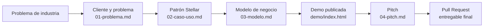

# Temario y plan de trabajo — Ideathon Stellar × BAF × CANACINTRA

| | |
|---|---|
| **Formato** | Jornada intensiva de un día · 8 horas efectivas (09:00–18:00) |
| **Audiencia** | Estudiantes universitarios de ingeniería, negocios y diseño. No se asume experiencia previa en blockchain ni en control de versiones |
| **Equipos** | 3 a 5 personas, preferentemente de perfiles mixtos |
| **Capacidad sugerida** | 40 a 60 asistentes (8 a 12 equipos) |
| **Resultado por equipo** | Una propuesta documentada, una demo publicada en internet con dirección propia, y un Pull Request integrado al repositorio del evento |
| **Resultado por asistente** | Al menos una contribución propia, pública y verificable, en el historial del proyecto |

**Repositorio del evento:** [github.com/MarxMad/Ideathon-Stellar-BAF-Canacintra](https://github.com/MarxMad/Ideathon-Stellar-BAF-Canacintra)

---

## Enfoque del programa

El objetivo no es enseñar a programar en una jornada, sino desarrollar el criterio para convertir un problema real de la industria en una propuesta ejecutable, y entregarla con las herramientas que se usan profesionalmente para colaborar en software.

GitHub cumple una doble función: es el espacio de trabajo de los equipos y, al mismo tiempo, el instrumento de medición del programa. Cada bloque de la jornada cierra con un archivo versionado, de modo que el avance queda registrado con autoría y marca de tiempo. El resultado es una evaluación basada en evidencia verificable por cualquier tercero, no en la percepción de los organizadores.

Un equipo que completa la jornada acumula entre 6 y 10 contribuciones, un Pull Request y una demo accesible desde cualquier navegador.

---

## Objetivos de aprendizaje

Al finalizar la jornada, el asistente será capaz de:

1. **Formular un problema de negocio** en términos de cliente, dolor y costo cuantificado.
2. **Evaluar si un problema justifica el uso de blockchain**, mediante un marco de cuatro criterios, y reconocer los casos en que no lo justifica.
3. **Explicar el valor de Stellar en lenguaje de negocio**: costo por transacción, tiempo de liquidación, activos digitales, anclas y estándares SEP.
4. **Asociar un problema de industria con un patrón técnico** del catálogo de casos de uso de Stellar.
5. **Construir un modelo de negocio mínimo**: quién paga, cuánto y frente a qué alternativa existente.
6. **Utilizar GitHub como herramienta de trabajo**: cuenta, fork, contribuciones, Pull Request y respuesta a una revisión, íntegramente desde el navegador.
7. **Publicar una demo funcional en internet** a partir de una plantilla, con dirección propia.
8. **Defender la propuesta en tres minutos** con una estructura de presentación definida.

---

## Agenda

| Hora | Min | Bloque | Modalidad | Entregable |
|---|---|---|---|---|
| 08:30–09:00 | 30 | **B0** · Registro y verificación de cuentas | Logística | Cuenta de GitHub activa |
| 09:00–09:30 | 30 | **B1** · Apertura: el reto y las verticales | Plenaria | Equipos formados |
| 09:30–10:15 | 45 | **B2** · GitHub aplicado y primera contribución | Taller | `participantes/<usuario>.md` |
| 10:15–11:15 | 60 | **B3** · Del problema al cliente | Taller | `01-problema.md` |
| 11:15–12:15 | 60 | **B4** · Stellar y catálogo de casos de uso | Sesión + taller | `02-caso-uso.md` |
| 12:15–13:00 | 45 | **B5** · Modelo de negocio y unit economics | Taller | `03-modelo.md` |
| 13:00–13:45 | 45 | Comida | — | — |
| 13:45–15:45 | **120** | **B6** · Sprint de construcción de la demo | Laboratorio | `demo/index.html`, `evidencia.md` |
| 15:45–15:55 | 10 | Pausa | — | — |
| 15:55–16:40 | 45 | **B7** · Publicación, Pull Request y revisión | Laboratorio | Demo publicada + Pull Request |
| 16:40–17:40 | 60 | **B8** · Presentaciones ante jurado | Plenaria | `04-pitch.md` |
| 17:40–18:00 | 20 | **B9** · Resultados, premiación y siguientes pasos | Plenaria | Pull Requests integrados |

**Total: 485 minutos de trabajo efectivo** dentro de una jornada de 9 horas. La estructura concentra el tiempo en dos talleres largos —el desarrollo de la propuesta de negocio por la mañana y la construcción de la demo por la tarde— y mantiene las interrupciones en el mínimo necesario.

---

## B0 · Registro y verificación de cuentas (08:30–09:00)

Recepción de asistentes y verificación de que cada persona cuenta con acceso operativo a GitHub antes de iniciar. El requisito de crear la cuenta se comunica por correo con 72 horas de anticipación, junto con la guía de inicio.

El registro captura el nombre de usuario de GitHub de cada asistente, que es la referencia con la que se construye el reporte de participación.

---

## B1 · Apertura: el reto y las verticales (09:00–09:30)

Presentación del programa, del reto y de los criterios de evaluación.

**El reto:** identificar un problema real de una empresa industrial mexicana y diseñar una solución en la que Stellar aporte una capacidad que hoy no está disponible a costo o velocidad razonables.

**Verticales propuestas.** Los equipos pueden elegir una o proponer la suya:

| Vertical | Problema representativo |
|---|---|
| **Pagos transfronterizos** | Liquidar a un proveedor extranjero sin los tiempos ni el diferencial cambiario de la banca tradicional |
| **Liquidez y factoraje** | Adelantar el cobro de una factura a 90 días sin el costo del factoraje bancario |
| **Trazabilidad de insumos** | Acreditar origen, lote y certificación de un material ante clientes y auditores |
| **Nómina y dispersión** | Pagar a decenas o cientos de trabajadores y proveedores externos en una sola operación |
| **Lealtad y membresías B2B** | Programas de puntos, garantías extendidas o acceso entre empresas asociadas |

El bloque cierra con la formación de equipos.

---

## B2 · GitHub aplicado y primera contribución (09:30–10:15)

Introducción práctica al flujo de trabajo colaborativo, ejecutada íntegramente desde el navegador: sin instalaciones, sin línea de comandos y sin configuración local. Cada archivo guardado desde la interfaz web constituye una contribución real, atribuida a su autor.

**Contenido:**

- Conceptos operativos —repositorio, contribución, fork, Pull Request e integración— explicados desde su función dentro de un equipo de trabajo.
- Ejercicio guiado: cada asistente crea su copia del repositorio del evento y publica su ficha de participante. Es su primera contribución al proyecto.
- Organización del equipo: se designa un repositorio de trabajo común y se incorpora al resto de los integrantes como colaboradores, de modo que cada uno contribuya bajo su propia autoría.

Al cierre del bloque, todos los asistentes tienen una contribución registrada a su nombre y los equipos están listos para trabajar.

---

## B3 · Del problema al cliente (10:15–11:15)

**Objetivo:** que cada equipo formule un problema que un empresario reconocería como propio.

**Contenido:**

- **El punto de partida no es la tecnología.** Una propuesta que comienza por la herramienta y busca después dónde aplicarla resulta identificable de inmediato para cualquier jurado.
- **Estructura del problema:** *[cliente específico] no puede [lograr algo] porque [obstáculo], y eso le cuesta [tiempo, dinero o riesgo cuantificado]*. Se contrastan formulaciones débiles y sólidas sobre casos reales de la industria.
- **Distinción entre cliente, usuario y pagador.** Buena parte de las propuestas fallan porque quien usa la solución no es quien la paga.
- **Evidencia.** Todo problema requiere tres fuentes de respaldo: una entrevista, un dato público verificable o la experiencia directa documentada de un integrante.
- **La alternativa actual como competencia real.** El problema ya se resuelve de algún modo —una hoja de cálculo, una transferencia bancaria, un intermediario— y esa práctica establecida es el punto de comparación obligado.

**Taller:** formulación del problema y validación cruzada entre equipos, en la que cada uno responde si pagaría por la solución del otro y por qué.

**Entregable:** `01-problema.md`

---

## B4 · Stellar y catálogo de casos de uso (11:15–12:15)

**Objetivo:** que cada equipo seleccione un patrón técnico con criterio y sepa argumentar la elección.

### Stellar en lenguaje de negocio

- Red pública para el movimiento de valor entre monedas y países, con liquidación en segundos y costo por transacción de fracciones de centavo.
- **Activos digitales:** representación de un peso, un dólar, una factura, un punto de lealtad o un certificado de origen.
- **Anclas y estándares SEP:** la capa que conecta la red con el sistema financiero tradicional, y que distingue una aplicación operable de un ejercicio teórico.
- **Contratos Soroban:** reglas de liquidación que se ejecutan automáticamente al cumplirse una condición.
- Comparación con las alternativas existentes: el valor diferencial aparece cuando hay operación transfronteriza, múltiples partes sin confianza mutua, o automatización de una liquidación hoy manual.

### Marco de decisión: ¿el problema justifica blockchain?

| # | Criterio |
|---|---|
| 1 | ¿Intervienen varias partes sin confianza plena entre sí que requieren el mismo registro? |
| 2 | ¿El registro debe ser auditable por un tercero: cliente, auditor, autoridad o certificador? |
| 3 | ¿El valor cruza fronteras o monedas? |
| 4 | ¿La automatización de la liquidación elimina un intermediario costoso o lento? |

Con menos de dos criterios cumplidos, la solución adecuada es una base de datos convencional. Identificarlo y declararlo es una respuesta válida y se evalúa favorablemente: el programa forma criterio técnico, no entusiasmo por una herramienta.

### Catálogo: problema de industria → patrón Stellar

Cada patrón cuenta con un contrato de referencia disponible y documentado.

| Problema de la industria | Patrón | Contrato de referencia |
|---|---|---|
| Pago a proveedor extranjero sin diferencial cambiario ni demora | Pago con conversión + ancla de salida | [`docs/sep-estandares-anclas.md`](../docs/sep-estandares-anclas.md) |
| Dispersión de nómina o pagos a múltiples proveedores | Dispersión en lote idempotente | [`contracts/payroll`](../contracts/payroll) |
| Liberación del pago condicionada al cumplimiento de la entrega | Custodia condicionada | [`contracts/escrow`](../contracts/escrow) |
| Adelanto del cobro de una factura a plazo | Crédito colateralizado / factoraje | [`contracts/loan`](../contracts/loan) |
| Acreditación de origen, lote y certificación de un insumo | Trazabilidad con eventos en cadena | [`contracts/food-trace`](../contracts/food-trace) |
| Fondo de ahorro o apartado por objetivo | Metas de ahorro | [`contracts/savings`](../contracts/savings) |
| Rendimiento sobre tesorería ociosa | Bóveda de rendimiento | [`contracts/yield`](../contracts/yield) |
| Membresías, garantías extendidas y acceso B2B | Credencial de membresía | [`contracts/nft-membership`](../contracts/nft-membership) |
| Decisiones colegiadas con voto verificable | Votación | [`contracts/voting`](../contracts/voting) |
| Constancias, asistencia y certificaciones | Registro de credenciales | [`contracts/attendance`](../contracts/attendance) |

Documentación completa de cada patrón —modelo mínimo, datos en cadena, eventos y riesgos— en [`docs/contratos-casos-uso.md`](../docs/contratos-casos-uso.md), y combinaciones de extremo a extremo en [`docs/playbooks-producto.md`](../docs/playbooks-producto.md).

**Taller:** selección del patrón, evaluación con el marco de cuatro criterios, delimitación de qué opera en cadena y qué permanece fuera, y alcance explícito de la propuesta.

**Entregable:** `02-caso-uso.md`

---

## B5 · Modelo de negocio y unit economics (12:15–13:00)

**Objetivo:** que la propuesta identifique una fuente de ingreso y la sostenga con números.

**Contenido:**

- **Modelos de ingreso aplicables:** comisión por transacción, suscripción por empresa, diferencial cambiario y comisión de originación.
- **Unit economics:** ingreso por operación menos costo de red, costo de conversión a moneda local y costo de operación. El costo de red en Stellar es marginal; el costo determinante está en la conversión y el cumplimiento normativo, y omitirlo es la debilidad más frecuente en este tipo de propuestas.
- **Dimensionamiento de mercado ascendente:** empresas alcanzables, por operaciones al mes, por ticket promedio, por comisión. La red de CANACINTRA constituye un canal de distribución identificable y cuantificable.
- **Oportunidad temporal:** qué condiciones regulatorias, tecnológicas o de mercado hacen viable hoy la propuesta.
- **Riesgo principal y mitigación:** regulatorio, de adopción o de dependencia de un proveedor. Su identificación explícita se evalúa favorablemente.
- **Primera empresa piloto:** una empresa concreta a la que se llevaría la propuesta, preferentemente asociada a la cámara.

**Entregable:** `03-modelo.md`

---

## B6 · Sprint de construcción de la demo (13:45–15:45)

**Objetivo:** que cada equipo publique una página funcional que comunique su propuesta sin necesidad de explicación adicional.

El formato elegido es una página web de un solo archivo. Es la vía más accesible para participantes sin experiencia en desarrollo: se edita en el navegador con el mismo flujo que el resto de los entregables de la jornada, no requiere instalación ni servidor, y GitHub Pages la publica con dirección propia. En la presentación ante el jurado, la diferencia entre exponer un documento y compartir una liga operable es sustancial.

### Niveles de entrega

Todos los equipos parten de la misma plantilla, comentada en español y con los puntos de edición señalados dentro del archivo.

| Nivel | Alcance | Requiere |
|---|---|---|
| **N1 · Página propia** (obligatorio) | Plantilla personalizada con el nombre de la propuesta, el problema y sus cifras, la comparación entre el proceso actual y el propuesto, y la identidad visual del equipo | Edición de texto en el navegador |
| **N2 · Demo interactiva** | El recorrido paso a paso de la solución, reescrito con el flujo propio del equipo: qué hace cada actor y qué ocurre en cada etapa | Edición de una lista de textos; no requiere programar |
| **N3 · Integración con Stellar** | La página consulta o ejecuta una operación real en la red de pruebas, o se conecta a un contrato desplegado | Perfil técnico en el equipo |

Los tres niveles concluyen con la página publicada: N1 ya constituye una página en línea, y N2 y N3 amplían su funcionalidad.

### Recursos de apoyo

| Nivel | Recurso |
|---|---|
| N1 y N2 | La plantilla, documentada paso a paso |
| N3 · operación en red de pruebas | [`exercises/01-pago-simple.md`](../exercises/01-pago-simple.md) |
| N3 · interfaz sobre contrato | [`docs/frontend-contratos.md`](../docs/frontend-contratos.md) y las interfaces de [`frontend/`](../frontend), que generan los formularios a partir de la especificación de cada contrato desplegado |
| Diagrama de la solución | [`docs/flujos-mermaid.md`](../docs/flujos-mermaid.md) |

### Estructura del bloque

| Tiempo | Actividad |
|---|---|
| 13:45–14:00 | Demostración en vivo del flujo de edición y publicación |
| 14:00–15:15 | Trabajo por equipos con acompañamiento de mentores |
| 15:15–15:45 | Cierre de la documentación de evidencia y, para los equipos que avanzan con holgura, niveles N2 y N3 |

**Entregables:** `demo/index.html` y `evidencia.md`

---

## B7 · Publicación, Pull Request y revisión (15:55–16:40)

Cierre del ciclo completo de contribución profesional.

1. **Publicación.** Cada equipo activa GitHub Pages en su repositorio de trabajo y obtiene la dirección pública de su demo, que se incorpora a la documentación y a la presentación.
2. **Pull Request.** Se propone formalmente el entregable al repositorio del evento, con una plantilla que incluye el listado de verificación correspondiente.
3. **Validación automática.** Una integración continua verifica la estructura del entregable, los campos pendientes de completar y la ausencia de credenciales expuestas, y devuelve el resultado en menos de un minuto.
4. **Revisión.** Cada mentor revisa los Pull Requests asignados y plantea una observación concreta sobre la propuesta.
5. **Iteración.** El equipo responde con una contribución de corrección. Para la mayoría de los asistentes es su primera experiencia respondiendo a una revisión técnica en un entorno público, y queda registrada como parte de la evaluación.

**Entregables:** demo publicada, Pull Request abierto y contribución posterior a la revisión.

---

## B8 · Presentaciones ante jurado (16:40–17:40)

Tres minutos por equipo y dos minutos de preguntas, con control de tiempo.

**Estructura de la presentación**, entregada previamente como `04-pitch.md`:

| Tiempo | Sección | Contenido |
|---|---|---|
| 0:00–0:30 | Problema | Formulación del problema con el costo cuantificado |
| 0:30–0:50 | Cliente | Quién es, cuántos son y quién paga |
| 0:50–1:50 | Solución y rol de Stellar | Qué opera en cadena, qué permanece fuera y la evaluación con el marco de cuatro criterios |
| 1:50–2:20 | Evidencia | La demo publicada y, en su caso, la operación en red de pruebas |
| 2:20–3:00 | Modelo y siguiente paso | Fuente de ingreso y primera empresa piloto identificada |

**Jurado:** tres integrantes con perfiles complementarios —viabilidad industrial, factibilidad técnica y modelo de negocio—, evaluando con la rúbrica del programa.

---

## B9 · Resultados, premiación y siguientes pasos (17:40–18:00)

- **Presentación de resultados:** contribuciones por participante y por equipo, Pull Requests integrados y demos publicadas, obtenidos directamente del historial del repositorio.
- **Integración de los entregables** aprobados al repositorio del evento, preservando la autoría individual de cada contribución.
- **Premiación** por categorías: mejor propuesta general, mejor formulación del problema, mejor uso de Stellar, mejor modelo de negocio, mejor demo y equipo con mejor ejecución.
- **Continuidad:** ruta de profundización a través del [programa de 12 semanas](../course/README.md) sobre Stellar y contratos Soroban, y vinculación con los programas de la fundación y con empresas de la cámara para pilotos.

---

## Evaluación

La calificación combina dos componentes independientes:

| Componente | Peso | Evalúa |
|---|---|---|
| Calidad de la propuesta: problema, ajuste a Stellar, modelo de negocio, demo y presentación | 70 | Jurado |
| Ejecución: autoría distribuida, contribuciones a lo largo de la jornada, entregable completo e iteración tras la revisión | 30 | Automático, a partir del historial del repositorio |

Criterios detallados en la [rúbrica del programa](rubrica.md).

---

## Resultados verificables

Al cierre de la jornada se entrega un reporte construido íntegramente a partir del historial de un repositorio público, auditable por cualquier tercero:

| Indicador | Objetivo |
|---|---|
| Asistentes con contribución propia | 100 % |
| Equipos con demo publicada y accesible | 100 % |
| Equipos con Pull Request integrado | ≥ 80 % |
| Equipos que iteraron tras la revisión | ≥ 50 % |
| Equipos con evidencia en red de pruebas | ≥ 30 % |

Cada asistente conserva además una contribución pública y una demo en línea como material de portafolio profesional, y el repositorio del evento queda como catálogo de propuestas disponible para las empresas asociadas a la cámara.

Definición de los indicadores y su método de cálculo en [metricas.md](metricas.md).

---

## Material incluido

| Material | Destinatario |
|---|---|
| Repositorio del evento configurado, con validación automática de entregables | Organización |
| Plantillas de los cinco entregables documentales | Participantes |
| Plantilla de demo web, comentada y lista para personalizar | Participantes |
| Guía de GitHub para asistentes sin experiencia previa | Participantes |
| Rúbrica de evaluación y guía de revisión para el jurado | Jurado y mentores |
| Reporte de resultados al cierre del evento | Organización |
